<div align="center">

<!-- ══ PROFILE PHOTO ══ -->


<br/><br/>

<!-- ══ PROFILE VIEWS + FOLLOWERS ══ -->


&nbsp;

&nbsp;


<br/><br/>

<!-- ══ SOCIAL BADGES ══ -->

<a href="https://sahnawaz-portfolio.vercel.app" target="_blank">
  
</a>
&nbsp;
<a href="mailto:shzthedigitalalchemist@gmail.com">
  
</a>
&nbsp;
<a href="https://linkedin.com/in/sahnawaz-ahmed-laskar-021608168" target="_blank">
  
</a>
&nbsp;
<a href="https://www.instagram.com/sahnawaz.ui.dev" target="_blank">
  
</a>
&nbsp;
<a href="https://github.com/SahnawazL" target="_blank">
  
</a>

</div>

---

## 🧑‍💻 About Me


```yaml
Name    : Sahnawaz Ahmed Laskar  (SHZ · The Digital Alchemist ✨)
Role    : Full Stack Developer & UI/UX Designer
Located : Silchar, Assam, India 🇮🇳
Edu     : MCA — Yenepoya University, Bangalore
Companies : Flipkart · Xiaomi India · Rapido
Email   : shzthedigitalalchemist@gmail.com
Status  : ✅ Open to Freelance & Full-Time Roles
Passion : Clarity · Responsiveness · Real-World Impact
```

> *"Crafting high-performance web applications and pixel-perfect interfaces —
> blending clean code with thoughtful design. I focus on **clarity**,
> **responsiveness**, and **real-world impact**."*

<br clear="right"/>

---

## 🛠️ Tech Stack

<div align="center">

### 🌐 Frontend


### ⚙️ Backend & Database


### 🎨 Design & Platforms


### 🤖 AI & Developer Tools


</div>

---

## 📈 Skill Proficiency

<div align="center">

| Skill | Proficiency | Level |
|:------|:-----------:|------:|
| 🌐 HTML / CSS / JS | `████████████████████░░` | **88%** |
| 🎨 UI/UX Design | `███████████████████░░░` | **85%** |
| ⚛️ React.js | `█████████████████░░░░░` | **78%** |
| 🗺️ Info Architecture | `██████████████████░░░░` | **80%** |
| 🧩 Problem Solving | `█████████████████████░` | **95%** |
| 🔗 Team Collaboration | `████████████████████░░` | **92%** |
| 📊 Data & Analytics | `████████████████████░░` | **88%** |
| 🏗️ Project Ownership | `███████████████████░░░` | **85%** |

</div>

---

## 📊 GitHub Stats

<div align="center">



</div>

---

## 💼 Work Experience

<details open>
<summary><b>📱 Xiaomi India — One Point One Solutions &nbsp;<code>2022 – 2023</code></b></summary>
<br/>

**L1 Inbound Support → MSM Troubleshooting (Pilot Batch)**

My first real IT-industry role — customer support, not development. Started on L1 inbound, taking live calls from Xiaomi customers. As I got sharper at diagnosing device issues, I was promoted into the Mobile Screen Mirroring (MSM) troubleshooting process, as part of the pilot batch handling that newly launched workflow. Commended by Team Leader Adiba Kirmani and Quality Head Hemalatha for meticulous output.

`L1 Inbound Support` `MSM Troubleshooting` `Pilot Batch`

</details>

---

<details open>
<summary><b>🛒 Flipkart — Ienergizer &nbsp;<code>2023</code></b></summary>
<br/>

**L2 Support — Returns & Refunds**

At India's largest e-commerce platform, worked L2 — handling backend return and refund queries escalated from frontline agents, the kind that needed deeper digging than a first-contact call could resolve. A customer support role, focused on accuracy and turnaround time on complex cases. Recognised by QA and HR for consistent professionalism and precision.

`L2 Support` `Returns & Refunds` `Escalation Handling`

</details>

---

<details open>
<summary><b>🛵 Rapido — Ienergizer &nbsp;<code>2023 – 2024</code></b></summary>
<br/>

**IT / Developer**

Rejoined Ienergizer specifically for the Rapido process — this time in an IT/Developer role rather than customer support. Worked on internal tooling for the process, led real-time chat support for ride, payment and driver-partner issues across peak-load shifts, and designed & delivered agent training programs on deep-resolution workflows, adopted floor-wide. IT Head Santoosh Reddy noted: *"He takes ownership, delivers impact and brings calm creativity."*

`IT / Developer` `Internal Tooling` `Agent Training` `Live Chat Support`

</details>

---

<details open>
<summary><b>💻 Freelance & Personal Projects &nbsp;<code>2021 – Present</code></b></summary>
<br/>

**Full Stack Developer & UI/UX Designer**

Parallel to every professional role above, built, shipped and iterated on real web products — from this portfolio to client sites and personal tools, every line of code a deliberate act of craft. Mastered HTML, CSS, JavaScript and design systems while managing multiple brand projects with production-level precision — zero templates, everything hand-coded.

`HTML / CSS / JS` `UI/UX Design` `Responsive Dev` `GitHub / VS Code`

</details>

---

## 🚀 Featured Projects

<div align="center">

| 🏅 | Project | Description | Stack |
|:--:|:--------|:------------|:------|
| ✨ | **[Portfolio Website](https://sahnawaz-portfolio.vercel.app)** | Animated portfolio with AI chatbot, particle engine & hacker terminal | `HTML` `CSS` `JS` `Groq AI` |
| 🤖 | **AI Chat Widget** | Custom chatbot with intent detection, Hindi/Bengali support, 14.4k msgs/day | `Groq AI` `Llama` `Serverless` |
| 📊 | **Analytics Dashboard** | Real-time data visualisation for business insights | `JS` `Firebase` `Chart.js` |
| 🎨 | **Client Brand Sites** | Pixel-perfect responsive sites delivered on time | `React` `Tailwind` `Vercel` |

</div>

---

## 💡 Services & Pricing

<div align="center">

| Service | Starting Price |
|:--------|:-------------:|
| 🌐 Full Website Design | **₹9,999** |
| 🗂️ Portfolio Website | **₹6,999** |
| 🛒 E-Commerce Store | **₹14,999** |
| 🎨 UI/UX Design (Figma) | **₹3,999 / screen** |
| ⚙️ Frontend Development | **₹4,999** |
| 🔧 Backend Development | **₹5,999** |
| 📈 SEO & Analytics | **₹3,999** |
| 🤖 AI Integration | **₹2,999** |
| 🌍 Custom Domain Setup | **₹1,500** |

</div>

---

## 📊 Contribution Snake

<div align="center">

<picture>
  <source media="(prefers-color-scheme: dark)"
    srcset="https://raw.githubusercontent.com/SahnawazL/SahnawazL/output/github-snake-dark.svg" />
  <source media="(prefers-color-scheme: light)"
    srcset="https://raw.githubusercontent.com/SahnawazL/SahnawazL/output/github-snake.svg" />
  
</picture>

</div>

---

<div align="center">

### 🌐 Let's Build Something Great Together

<a href="https://sahnawaz-portfolio.vercel.app" target="_blank">
  
</a>

<br/><br/>

<a href="https://linkedin.com/in/sahnawaz-ahmed-laskar-021608168" target="_blank">
  
</a>
&nbsp;
<a href="https://www.instagram.com/sahnawaz.ui.dev" target="_blank">
  
</a>
&nbsp;
<a href="mailto:shzthedigitalalchemist@gmail.com">
  
</a>
&nbsp;
<a href="https://www.facebook.com/sahnawazahmed.laskar" target="_blank">
  
</a>
&nbsp;
<a href="https://github.com/SahnawazL" target="_blank">
  
</a>

<br/><br/>


---

*⚡ Designed & coded with passion from Silchar, Assam, India 🇮🇳*

*"Clarity. Responsiveness. Impact." — © 2026 Sahnawaz Ahmed Laskar | UI*

</div>
